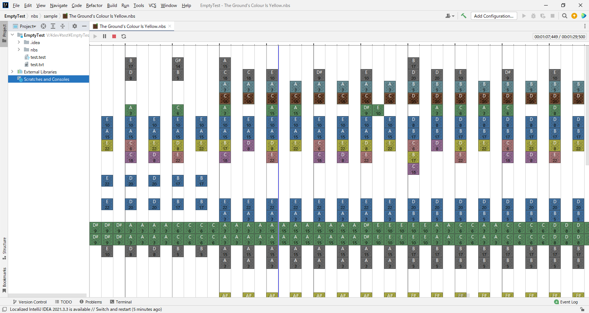

# IntelliJ NBS Player

This project is an IntelliJ plugin
<!-- Plugin description -->
Supports playback and display of [NBS format](https://opennbs.org/nbs) files.  
  
Editing is not supported, please use [Open Note Block Studio](https://opennbs.org/).

Support for each version of NBS:

- Version 5, Confirmed to work with sample songs included in Open Note Block Studio
- Version 1~4, Unconfirmed, but should work
- Classic, Confirmed to work with multiple songs

If you find an NBS file that does not work, please send us the file and its status
via [issue](https://github.com/MORIMORI0317/intellij-nbs-player/issues).

<!-- Plugin description end -->
